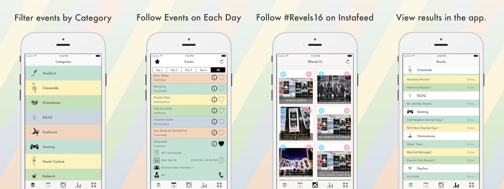

# Revels-16

The Official iOS App for Revels'16 cultural fest of MIT, Manipal.

Open-Source Project.

--------------------
##Features

- Event descriptions along with location, time, date and contact info.
- Registrations and bookings.
- Offline Save (Persistancy).
- Add interesting events to the favourites list.
- Get Results on the go.
- 3D Touch enabled Quick Action Menu from homescreen.
- Instagram Integration.
- Beautiful UI.

--------------------

##The app uses:

- [Parse](http://www.parse.com) as backend for notifications and alerts.
- [Colors](https://github.com/bennyguitar/Colours) to simplify colors, and default theming.
- [SDWebImage](https://github.com/rs/SDWebImage) for caching and async loading of images.
- [SVProgressHUD](https://github.com/SVProgressHUD/SVProgressHUD) as a clean and minimal heads up display. 
- [KWTransition](https://github.com/KurtWagner/KWTransition) for some view transistions.
- [DZNEmptyDataSet](https://github.com/dzenbot/DZNEmptyDataSet) to easily handle empty data sets.
- [CAAnimationBlocks](https://github.com/xissburg/CAAnimationBlocks) to allow the usage of start and completion blocks in CAAnimation instances.
- [UINavigationItem-Loading](https://github.com/Just-/UINavigationItem-Loading) to show loading progress in naigation bar.

--------------------

###Keys

The Project uses [Parse](http://www.parse.com) as backend and therefore needs Client key and Application ID.  
To obtain these you may message us at our [Facebook Page](https://www.facebook.com/LUGManipal/).